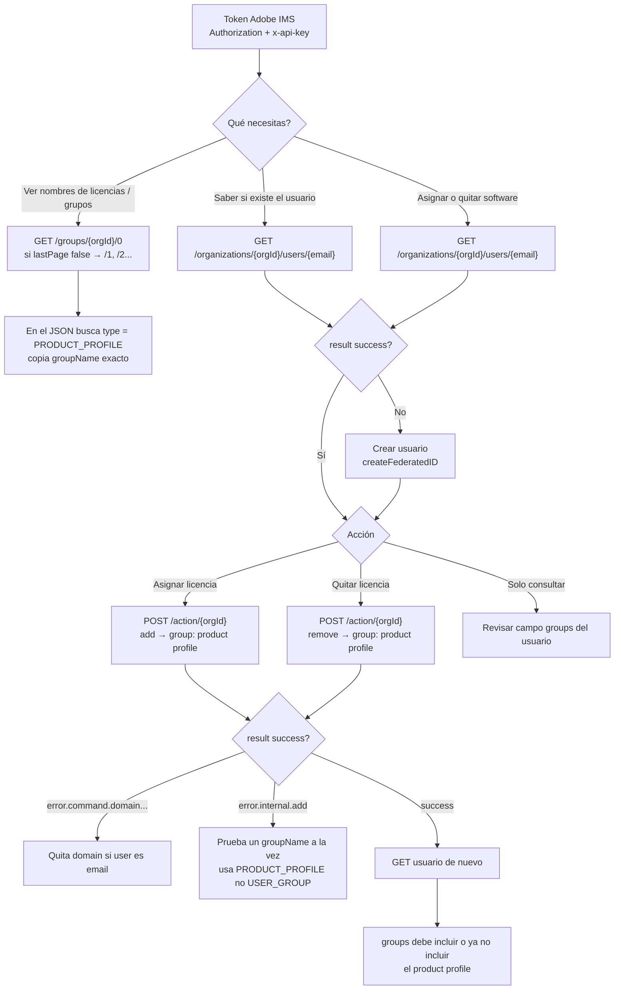

# Adobe User Management API — consultar, asignar y desasignar licencias

Guía operativa (Postman) para la **Adobe User Management API (UMAPI)**.

En Adobe **asignar software = agregar al product profile**. Un user group (`Usuarios Tecmilenio`, `GG-UTM-Empleados`) no otorga licencia por sí solo.

Base URL: `https://usermanagement.adobe.io/v2/usermanagement`

---

## Headers (todos los requests)

| Header | Valor |
|--------|--------|
| `Authorization` | `Bearer {{ACCESS_TOKEN}}` |
| `x-api-key` | `{{CLIENT_ID}}` |
| `Content-Type` | `application/json` (solo en POST) |
| `Accept` | `application/json` |

El email en el path debe ir URL-encoded: `@` → `%40`.

---

## Flujo



### Orden práctico

1. Token + headers.
2. `GET` del usuario → existe y qué trae en `groups`.
3. `GET` de grupos → elige `groupName` con `type: PRODUCT_PROFILE`.
4. `POST` `add` o `remove` **sin** `domain` si `user` es un correo.
5. `GET` del usuario otra vez para confirmar.

No llega correo de forma fiable. La verificación es el `GET` (o Admin Console).

---

## 1. Consultar un usuario

```http
GET https://usermanagement.adobe.io/v2/usermanagement/organizations/{{ORGANIZATION_ID}}/users/t-mgonzalezr%40tecmilenio.mx
```

Respuesta esperada: JSON con `result: "success"` y `user.groups`.

Si el body es HTML, el `@` no está encodeado o faltan headers.

---

## 2. Listar grupos (nombres para `"group"`)

```http
GET https://usermanagement.adobe.io/v2/usermanagement/groups/{{ORGANIZATION_ID}}/0
```

Si `lastPage` es `false`, continúa con `/1`, `/2`, etc.

Copia **`groupName`** exacto. Tipos:

| `type` | Qué es | ¿Asigna software? |
|--------|--------|-------------------|
| `PRODUCT_PROFILE` | Product profile / licencia | **Sí** |
| `USER_GROUP` | Grupo de usuarios | No (salvo que esté ligado a un profile) |
| `DEVELOPER_GROUP` | Prefijo `_developer_...` | Rol developer, no la licencia |

---

## 3. Asignar licencia

```http
POST https://usermanagement.adobe.io/v2/usermanagement/action/{{ORGANIZATION_ID}}
```

```json
[
  {
    "user": "t-mgonzalezr@tecmilenio.mx",
    "do": [
      {
        "add": {
          "group": ["NOMBRE_EXACTO_DEL_PRODUCT_PROFILE"]
        }
      }
    ]
  }
]
```

Opcional: `?testOnly=true` valida sin aplicar cambios.

---

## 4. Desasignar licencia

Mismo `POST` `/action/{orgId}`:

```json
[
  {
    "user": "t-mgonzalezr@tecmilenio.mx",
    "do": [
      {
        "remove": {
          "group": ["NOMBRE_EXACTO_DEL_PRODUCT_PROFILE"]
        }
      }
    ]
  }
]
```

---

## 5. Crear usuario (solo si el GET no lo encuentra)

```json
[
  {
    "user": "t-mgonzalezr@tecmilenio.mx",
    "do": [
      {
        "createFederatedID": {
          "email": "t-mgonzalezr@tecmilenio.mx",
          "country": "MX",
          "firstname": "Miguel Osvaldo",
          "lastname": "Gonzalez Romo"
        }
      },
      {
        "add": {
          "group": ["NOMBRE_EXACTO_DEL_PRODUCT_PROFILE"]
        }
      }
    ]
  }
]
```

---

## Errores frecuentes

| Error | Causa | Qué hacer |
|-------|--------|-----------|
| `error.command.domain.must_be_used_with_nonemail_username` | Mandaste `domain` con un email en `user` | Quita `domain` |
| `error.internal.add` | Grupo inválido o usuario no listo | Un `groupName` a la vez; usa `PRODUCT_PROFILE` |
| HTML / 106 KB en GET usuario | `@` sin encodear o headers mal | Usa `%40` y los mismos headers del listado |
| Usuario no aparece en page `0` | Paginación del listado | Busca con GET de un usuario, no el listado |

---

## Portal (Automatización de Licencias)

En **version4** el browser **no** llama a UMAPI directamente. Flujo:

```
Browser → SWA /api/v1/adobe/* (cookie) → FA C# (x-fa-api-key) → Key Vault + UMAPI
```

| Ruta portal | Uso |
|-------------|-----|
| `GET /api/v1/adobe/cuotas` | Cupos profesor / alumno |
| `GET /api/v1/adobe/miembros?perfil=` | Detalle paginado |
| `GET /api/v1/adobe/usuario?email=` | Usuario + grupos |
| `POST /api/v1/adobe/licencias` | Asignar / revocar |

Grupos de licencia en esta org: **`Colaboradores y Profesores Tecmilenio`** y **`Alumnos Tecmilenio`** (`USER_GROUP`). Ver [ASIGNACION-LICENCIAS.md](./ASIGNACION-LICENCIAS.md).

Credenciales OAuth: **Key Vault** (`KV-DEVL-AprovLicencias`), leídas por la FA C# — no App Settings del SWA.

---

## Consola C#

Hay una app de consola .NET 8 con estos mismos flujos (menú interactivo):

[tools/AdobeUmapiConsole/README.md](../tools/AdobeUmapiConsole/README.md)

```bash
cd tools/AdobeUmapiConsole
copy appsettings.example.json appsettings.json
dotnet run
```

---

## Referencias Adobe

- [Get User Information](https://adobe-apiplatform.github.io/umapi-documentation/en/api/getUser.html)
- [Get Users in Organization](https://adobe-apiplatform.github.io/umapi-documentation/en/api/getUsersWithPage.html)
- [Get User Groups and Product Profiles](https://adobe-apiplatform.github.io/umapi-documentation/en/api/group.html)
- [User Management Action Commands](https://adobe-apiplatform.github.io/umapi-documentation/en/api/ActionsCmds.html)
