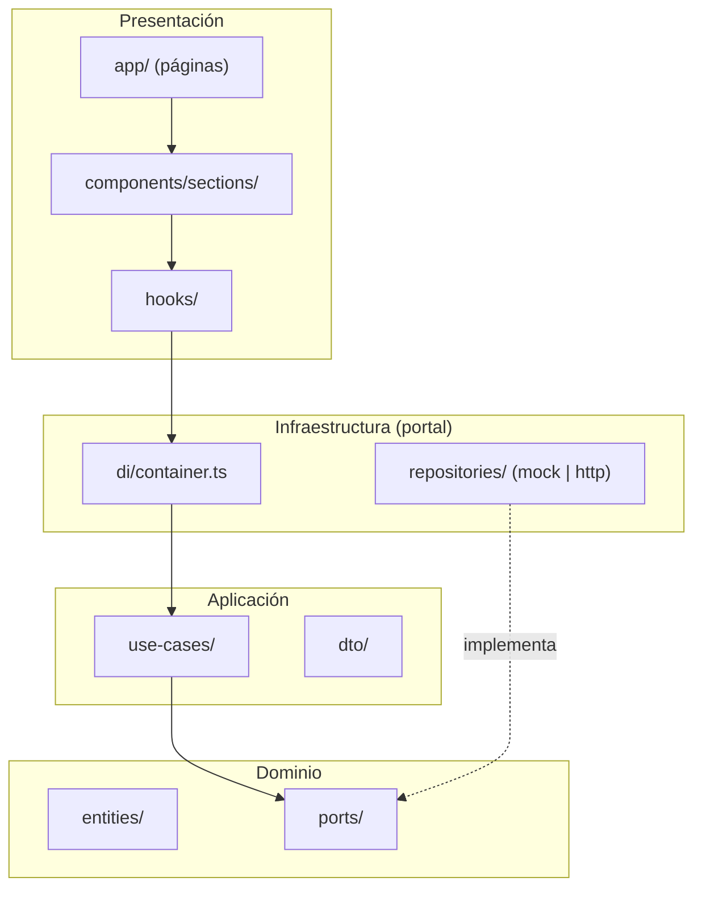
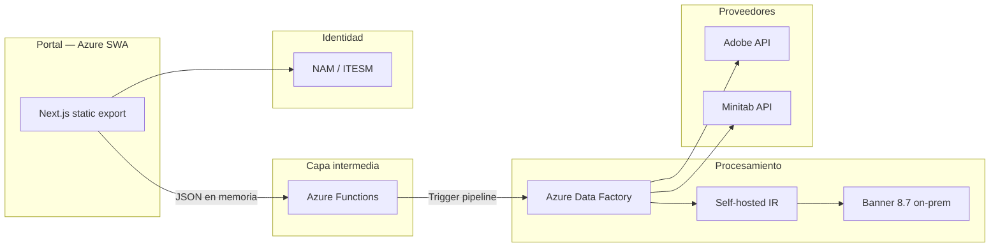
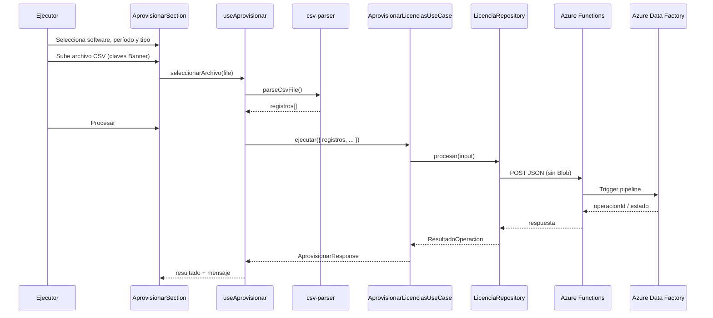
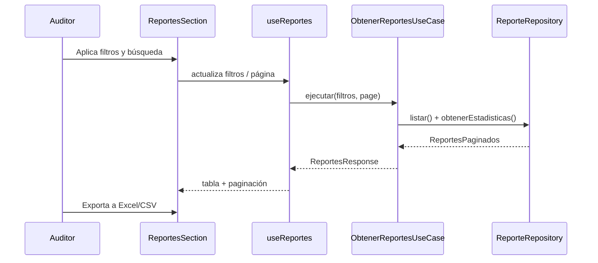
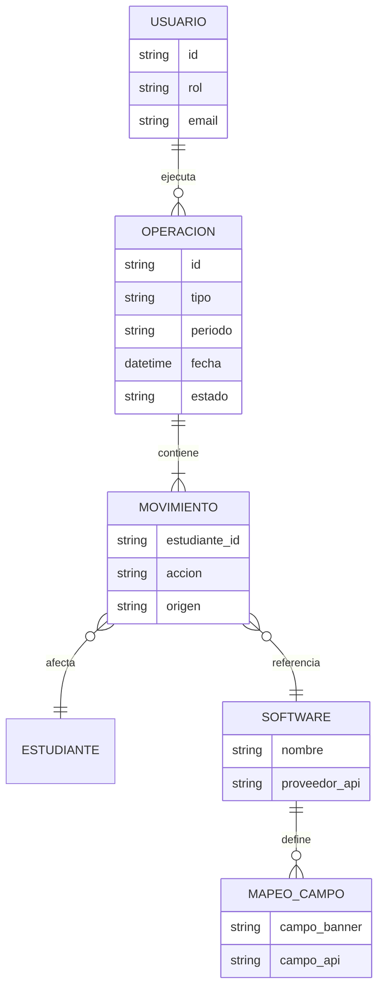

# Arquitectura — Automatización de Licencias

## 1. Resumen

Sistema frontend para la gestión de licencias de software educativo. Permite aprovisionar y desaprovisionar licencias mediante archivos CSV con claves Banner, consultar reportes de auditoría y configurar integraciones con proveedores (Adobe, Minitab).

La aplicación está construida con **Next.js 15 (App Router)**, **React 18** y **TypeScript**, siguiendo **Clean Architecture** con capas de dominio, aplicación, infraestructura y presentación (hooks + componentes).

---

## 2. Stack tecnológico

| Capa | Tecnología | Propósito |
|------|------------|-----------|
| Framework | Next.js 15 | SSR/SSG, enrutamiento, optimización de assets |
| UI | React 18 | Componentes interactivos |
| Lenguaje | TypeScript | Tipado estático y mantenibilidad |
| Estilos | Tailwind CSS 4 | Diseño utility-first y tema institucional |
| Gráficas | Recharts | Visualización de tendencias de licencias |
| Iconos | Lucide React | Iconografía consistente |
| Componentes base | Radix UI + shadcn/ui | Accesibilidad y primitivos UI |

---

## 3. Diagrama de arquitectura

### 3.1 Capas del portal (Clean Architecture)



### 3.2 Integración Azure (decisión de proyecto)



> **Nota:** El CSV del Ejecutor **no se guarda en Blob Storage**. El portal parsea el archivo y envía `registros[]` como JSON a Azure Functions, que dispara ADF. Ver [DECISIONES-ARQUITECTURA.md](./DECISIONES-ARQUITECTURA.md).

---

## 4. Estructura de carpetas

```
AutomatizacionLicencias/
├── app/                          # App Router (Next.js)
│   ├── layout.tsx                # Layout raíz + metadata + RoleProvider
│   ├── globals.css               # Tema Tailwind y variables CSS
│   ├── page.tsx                  # Redirección a /login
│   ├── login/page.tsx            # Pantalla de autenticación
│   └── (app)/                    # Grupo de rutas con shell compartido
│       ├── layout.tsx            # AppShell (sidebar + contenido)
│       ├── dashboard/page.tsx
│       ├── aprovisionar/page.tsx
│       ├── reportes/page.tsx
│       └── configuracion/page.tsx
│
├── domain/                       # Capa de dominio (sin dependencias externas)
│   ├── entities/                 # Entidades y agregados
│   ├── value-objects/            # Tipos de valor (SoftwareId, TipoOperacion)
│   └── ports/                    # Interfaces (repositorios, gateways)
│
├── application/                  # Casos de uso y DTOs
│   ├── dto/
│   └── use-cases/
│
├── infrastructure/               # Implementaciones concretas
│   ├── mocks/data.ts             # Datos de demostración
│   ├── repositories/             # Repositorios mock
│   ├── adapters/                 # Adobe, Minitab
│   └── di/container.ts           # Inyección de dependencias
│
├── hooks/                        # Puente UI ↔ casos de uso
│   ├── use-aprovisionar.ts
│   ├── use-dashboard.ts
│   ├── use-reportes.ts
│   └── use-configuracion.ts
│
├── components/
│   ├── auth/
│   ├── layout/
│   ├── sections/                 # Solo presentación (usan hooks)
│   └── ui/
│
├── lib/
│   ├── constants.ts              # Rutas, roles y navegación
│   ├── csv-parser.ts             # Parseo CSV → RegistroBanner[] (cliente)
│   ├── api-config.ts             # URL base Azure Functions
│   └── mock-data.ts              # Reexport temporal (deprecated)
│
├── public/
├── docs/
├── next.config.ts
├── tsconfig.json
└── package.json
```

---

## 5. Patrones de diseño

### 5.1 App Router y rutas por módulo

Cada módulo funcional tiene su propia ruta:

| Ruta | Módulo | Rol(es) con acceso |
|------|--------|-------------------|
| `/dashboard` | Panel general | Admin, Auditor |
| `/aprovisionar` | Gestión de licencias | Admin, Ejecutor |
| `/reportes` | Historial y auditoría | Admin, Auditor |
| `/configuracion` | Proveedores y ETL | Admin, Ejecutor |

El grupo `(app)` agrupa las rutas que comparten el mismo layout (sidebar + área de contenido) sin afectar la URL.

### 5.2 Server vs Client Components

| Tipo | Ubicación | Uso |
|------|-----------|-----|
| **Server Component** | `app/**/page.tsx`, `app-shell.tsx` | Páginas estáticas, composición sin estado |
| **Client Component** | `components/sections/*`, `sidebar.tsx` | Estado local, gráficas, formularios, drag & drop |

Las secciones llevan `"use client"` porque usan `useState`, eventos del DOM o librerías solo compatibles con cliente (Recharts).

### 5.3 Contexto de rol (`RoleProvider`)

El selector de rol (Administrador / Ejecutor / Auditor) vive en un React Context en `components/layout/role-provider.tsx`:

- Filtra ítems de navegación visibles en el sidebar.
- Redirige automáticamente si el usuario cambia a un rol sin acceso a la ruta actual.

En producción, el rol debe provenir de **NAM** (autenticación institucional ITESM) y validarse en el portal y en Azure Functions.

### 5.4 Clean Architecture — flujo de dependencias

Las dependencias apuntan siempre hacia el dominio:

```
components/sections → hooks/ → application/use-cases → domain/ports
                                              ↑
                              infrastructure/repositories (implementa ports)
```

| Capa | Responsabilidad |
|------|-----------------|
| **domain/** | Entidades, value objects y puertos (interfaces) |
| **application/** | Casos de uso que orquestan la lógica de negocio |
| **infrastructure/** | Repositorios mock, adapters Adobe/Minitab, DI |
| **hooks/** | Estado de UI y llamadas a casos de uso |
| **components/sections/** | Renderizado; sin lógica de filtrado ni acceso a datos |

Casos de uso actuales:

| Caso de uso | Hook | Sección |
|-------------|------|---------|
| `AprovisionarLicenciasUseCase` | `useAprovisionar` | aprovisionar |
| `ObtenerDashboardUseCase` | `useDashboard` | dashboard |
| `ObtenerReportesUseCase` | `useReportes` | reportes |
| `ObtenerConfiguracionUseCase` | `useConfiguracion` | configuración |

Al conectar APIs reales, crear implementaciones HTTP en `infrastructure/repositories/` (p. ej. `http-licencia.repository.ts`) que llamen a **Azure Functions** sin modificar dominio ni casos de uso.

---

## 6. Flujos principales

### 6.1 Aprovisionamiento de licencias



### 6.2 Reportes de auditoría



---

## 7. Modelo de dominio (conceptual)



---

## 8. Seguridad y roles

| Rol | Permisos |
|-----|----------|
| **Administrador** | Dashboard, aprovisionar, reportes, configuración |
| **Ejecutor** | Aprovisionar, configuración |
| **Auditor** | Dashboard (lectura), reportes |

**Recomendaciones para producción:**

1. Autenticación **NAM** gestionada con `dsi.identidad@itesm.mx`.
2. Azure Functions valida token/sesión y rol antes de disparar ADF.
3. Credenciales Adobe/Minitab en **Key Vault** (validar con Juan Manuel).
4. Self-hosted IR para Banner 8.7 (validar con Oliver).
5. Auditoría de movimientos vía salida del ETL (origen por confirmar).

---

## 9. Variables de entorno

### Portal (front — SWA)

```env
# Azure Functions (BFF)
NEXT_PUBLIC_API_BASE_URL=https://func-licencias.azurewebsites.net/api
```

### Backend (Azure Functions / ADF — no en el repositorio)

```env
# Key Vault references — validar con Juan Manuel
ADOBE_CLIENT_ID=
ADOBE_CLIENT_SECRET=
ADOBE_ORG_ID=
MINITAB_API_KEY=
MINITAB_BASE_URL=

# ADF
ADF_PIPELINE_TRIGGER_URL=
```

> Las credenciales de proveedores **nunca** van en el front. Solo `NEXT_PUBLIC_*` en SWA.

---

## 10. Scripts disponibles

| Comando | Descripción |
|---------|-------------|
| `npm run dev` | Servidor de desarrollo en puerto 3000 |
| `npm run build` | Compilación de producción |
| `npm start` | Servidor de producción |
| `npm run lint` | Análisis estático con ESLint de Next.js |

---

## 11. Roadmap técnico

1. **Fase 1 (actual):** UI funcional, Clean Architecture con repositorios mock, parseo CSV en cliente, deploy SWA static.
2. **Fase 2:** Repositorios HTTP → Azure Functions → ADF; sustituir mocks.
3. **Fase 3:** Autenticación **NAM** y autorización por rol en portal + Functions.
4. **Fase 4:** Jobs programados Banner (ADF + SHIR) y reportes desde ETL.
5. **Fase 5:** Tests E2E (Playwright) y monitoreo de operaciones masivas.

---

## 12. Decisiones técnicas

| Decisión | Motivo |
|----------|--------|
| Next.js App Router | Rutas por módulo, layouts anidados, preparado para SSR y API |
| TypeScript estricto | Contratos claros entre capas y menos errores en integraciones |
| Tailwind CSS 4 | Consistencia visual y tema Tecmilenio ya definido |
| Client Components en secciones | Interactividad inmediata sin complejidad de hidratación en gráficas |
| Clean Architecture | Dominio estable; infraestructura intercambiable sin tocar UI |
| Repositorios mock | Desacopla UI de backends aún no implementados |
| SWA static + Functions | Portal sin backend embebido; API en Azure Functions |
| CSV → JSON en memoria | Sin Blob Storage en upload; menor latencia y costo |
| `HttpLicenciaRepository` | Listo para conectar cuando exista `NEXT_PUBLIC_API_BASE_URL` |

---

## 13. Documentación relacionada

- [Decisiones de arquitectura Azure](./DECISIONES-ARQUITECTURA.md)
- [Endpoints Épica 2](./EPICA-2-ENDPOINTS.md)
- [Deploy Azure SWA](./DEPLOY-AZURE-SWA.md)

---

*Última actualización: junio 2026*
