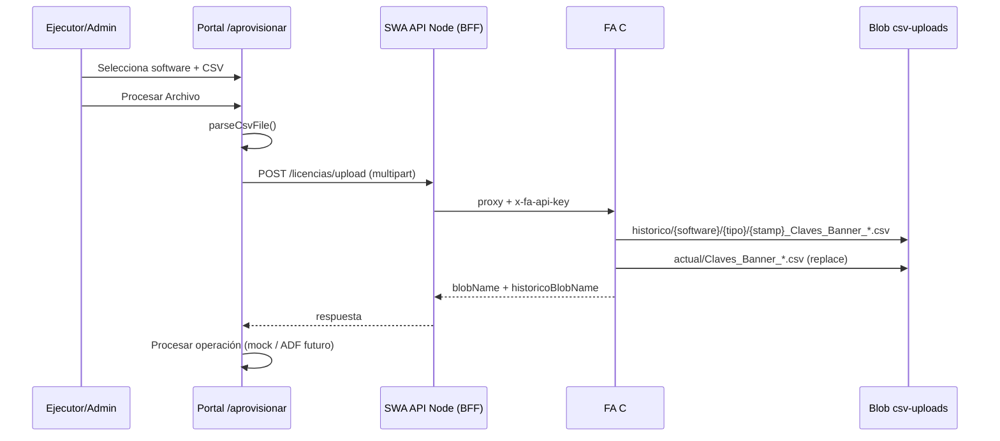

# CSV en Azure Blob Storage

Guía de la carga de archivos CSV desde **Carga archivo** (`/aprovisionar`) hacia la cuenta **`stgstddevaprovlicencias`**.

Cada vez que el usuario pulsa **Procesar Archivo**:

1. El portal valida y parsea el CSV en el navegador.
2. Sube el archivo a la API (`POST /api/v1/licencias/upload`).
3. El BFF SWA reenvía a la **FA C#**, que guarda **dos copias** en Blob Storage.
4. Continúa el flujo de procesamiento (mock hoy; ADF en el futuro).

---

## Estructura en Storage

Contenedor (por defecto): **`csv-uploads`**

```
csv-uploads/
├── actual/                          ← vigente (nombre fijo, se reemplaza)
│   ├── Claves_Banner_Adobe.csv
│   └── Claves_Banner_Minitab.csv
└── historico/                       ← una copia por cada carga
    ├── adobe/
    │   └── aprov/
    │       └── 2026-08-19T18-30-00-000Z_Claves_Banner_Adobe.csv
    └── minitab/
        └── aprov/
            └── 2026-08-19T18-31-00-000Z_Claves_Banner_Minitab.csv
```

| Carpeta | Comportamiento |
|---------|----------------|
| `actual/` | Siempre el mismo nombre por software. ADF u otros jobs pueden leer una ruta fija. |
| `historico/` | Archivo nuevo en cada upload (timestamp). No se sobrescribe. |

El contenedor se **crea automáticamente** en el primer upload (`createIfNotExists`).

---

## Flujo



---

## Configuración Azure

### SWA (BFF)

| Setting | Valor |
|---------|--------|
| `FaApiKey` / `FaBaseUrl` | Proxy hacia FA C# |
| `StorageConnectionString` | ACS → tabla `AuthorizedUsers` (login) |

### FA C# (`FA-DEVL-AprovLicencias`)

| Setting | Valor |
|---------|--------|
| `StorageConnectionString` | Connection string de `stgstddevaprovlicencias` |
| `CsvUploadContainer` | `csv-uploads` |

La misma connection string en la FA sirve para **Table** (CRUD usuarios) y **Blob** (CSV).

No subas el connection string al repositorio. Usa `api/local.settings.json` en local (gitignored).

Ejemplo local (`api/local.settings.json`):

```json
{
  "Values": {
    "StorageConnectionString": "DefaultEndpointsProtocol=https;AccountName=stgstddevaprovlicencias;...",
    "CsvUploadContainer": "csv-uploads"
  }
}
```

---

## API

### POST `/api/v1/licencias/upload`

**Auth:** cookie de sesión SAML · roles **`admin`** o **`ejecutor`**

**Body:** `multipart/form-data`

| Campo | Valor |
|-------|--------|
| `file` | Archivo `.csv` |
| `software` | `adobe` \| `minitab` |
| `tipo` | `aprov` \| `desaprov` |

**Respuesta 201 (ejemplo):**

```json
{
  "ok": true,
  "container": "csv-uploads",
  "blobName": "actual/Claves_Banner_Adobe.csv",
  "blobUrl": "https://stgstddevaprovlicencias.blob.core.windows.net/...",
  "historicoBlobName": "historico/adobe/aprov/2026-08-19T18-30-00-000Z_Claves_Banner_Adobe.csv",
  "historicoBlobUrl": "https://...",
  "size": 1234,
  "uploadedAt": "2026-08-19T18:30:00.000Z",
  "software": "adobe",
  "tipo": "aprov",
  "fileName": "Claves Banner Adobe.csv"
}
```

**Errores comunes:**

| HTTP | Causa |
|------|--------|
| 401 | Sin sesión |
| 403 | Rol no permitido |
| 503 | FA sin `StorageConnectionString` o proxy no configurado (`faProxy: false`) |
| 400 | CSV vacío, software/tipo inválido |

### Health

```
GET /api/v1/health
```

Revisar:

- `faProxy: true`
- `endpoints.licenciasUpload`
- En FA: `GET /api/v1/health` con storage configurado

---

## Front (React)

| Archivo | Rol |
|---------|-----|
| `hooks/use-aprovisionar.ts` | Llama upload antes de procesar |
| `lib/upload-csv.ts` | `FormData` → API |
| `components/sections/aprovisionar-section.tsx` | Muestra rutas vigente + histórico |

Requiere `NEXT_PUBLIC_API_BASE_URL` apuntando al SWA (`…/api`).

---

## Nombre del archivo local vs storage

El portal valida que el CSV subido por el usuario se llame como:

- `Claves Banner Adobe.csv`
- `Claves Banner Minitab.csv`

En Storage el vigente usa guiones bajos:

- `Claves_Banner_Adobe.csv`
- `Claves_Banner_Minitab.csv`

---

## Verificar en Storage Explorer

1. Cuenta **`stgstddevaprovlicencias`**
2. Contenedor **`csv-uploads`**
3. Carpeta **`actual/`** → debe existir el CSV del software procesado
4. Carpeta **`historico/`** → una entrada nueva por cada **Procesar**

---

## Archivos en el repo

| Ruta | Descripción |
|------|-------------|
| `api/src/functions/licencias-upload.js` | Proxy HTTP → FA |
| `api/src/lib/fa-proxy.js` | Reenvío con `x-fa-api-key` |
| `api/src/lib/require-role.js` | Auth admin/ejecutor |
| `lib/upload-csv.ts` | Cliente front |
| `back-aprov-licencias/.../LicenciasUploadFunction.cs` | Upload real en Blob |

---

## Próximo paso (ADF)

El pipeline de Azure Data Factory puede leer siempre:

```
csv-uploads/actual/Claves_Banner_Adobe.csv
csv-uploads/actual/Claves_Banner_Minitab.csv
```

El histórico queda disponible para auditoría sin cambiar la ruta que consume el ETL.
