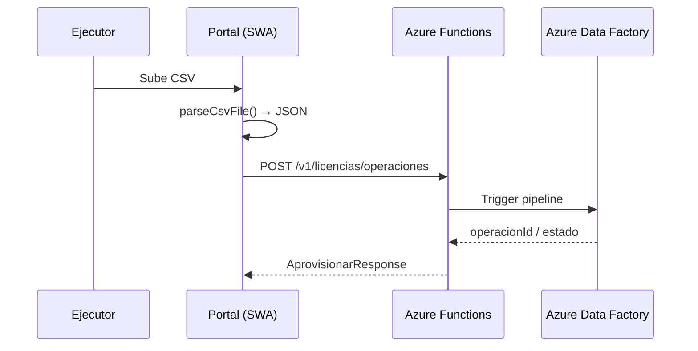

# Decisiones de arquitectura — Integración Azure

Registro de decisiones tomadas con el equipo de infraestructura y pendientes de validación.

---

## 1. Carga de CSV (Ejecutor)

| Decisión | Detalle |
|----------|---------|
| **No usar Blob Storage** para el upload del CSV | El objetivo es que el ETL procese la información, no persistir el archivo |
| **Flujo acordado** | Portal parsea CSV → JSON en memoria → POST a Azure Functions → trigger ADF |
| **Implementación front** | `lib/csv-parser.ts` + `useAprovisionar` envían `registros[]` |
| **Implementación back** | Azure Functions recibe JSON y dispara pipeline ADF |

---

## 2. Hospedaje del portal (front)

| Decisión | Detalle |
|----------|---------|
| **Azure Static Web Apps** | Recomendado para el portal Next.js en **modo static export** |
| **No requiere hybrid Next.js** | La API vive en Azure Functions, no en Route Handlers de Next |
| **Linked Backend** | SWA apunta a Functions como backend vinculado |
| **Consultoría** | El equipo de desarrollo apoya evolución del producto; la arquitectura puede refinarse |

Ver [DEPLOY-AZURE-SWA.md](./DEPLOY-AZURE-SWA.md).

---

## 3. Intermediario front ↔ ADF

| Decisión | Detalle |
|----------|---------|
| **Azure Functions** como BFF | ADF no recibe llamadas directas del navegador |
| **No API Management** (por ahora) | Functions es suficiente para el alcance actual |
| **Repositorio front** | `HttpLicenciaRepository` llama a Functions con JSON |

---

## 4. Integration Runtime (Banner 8.7)

| Estado | Detalle |
|--------|---------|
| **Pendiente validar** | Self-hosted IR debería estar configurado on-premise |
| **Contacto** | Oliver (infra) |

ADF usa el SHIR para conectar con Banner 8.7 en red institucional.

---

## 5. Credenciales Adobe y Minitab

| Estado | Detalle |
|--------|---------|
| **Pendiente validar** | Confirmar si ya existen credenciales |
| **Contacto** | Juan Manuel |
| **Almacenamiento recomendado** | Azure Key Vault (acceso desde Functions/ADF, nunca en el front) |

---

## 6. Autenticación NAM

| Tema | Estado |
|------|--------|
| **Registro de la app** | Gestionar con equipo identidad: `dsi.identidad@itesm.mx` |
| **Mecanismo de integración** | Solicitar documentación actualizada al equipo identidad |
| **Front** | Login vía NAM (no Azure Entra ID genérico) |
| **Functions** | Validar token/sesión NAM en cada request |

---

## 7. Permisos por desarrollador

| Rol | Permiso recomendado |
|-----|---------------------|
| **Mike (front)** | Contributor sobre el Resource Group del proyecto |
| **Alfonso** | Contributor sobre el Resource Group del proyecto |

Suficiente para SWA, Functions, ver recursos y colaborar en deploy.

---

## 8. Reportes / auditoría

| Tema | Detalle |
|------|---------|
| **Upload CSV** | Sin Blob |
| **Historial de reportes** | Origen por confirmar (posible salida del ETL/ADF, no necesariamente Blob) |
| **UI** | Copy actualizado a “Historial sincronizado desde ETL” |

---

## 9. Pendientes (checklist)

- [ ] Oliver — validar Self-hosted Integration Runtime operativo
- [ ] Juan Manuel — credenciales Adobe/Minitab + Key Vault
- [ ] Identidad ITESM — registro app NAM + documentación de integración
- [ ] Alfonso — contrato exacto del trigger ADF (payload, respuesta, `operacionId`)
- [ ] Equipo ADF — confirmar origen de datos para módulo de reportes

---

## Referencias

- [Arquitectura](./ARQUITECTURA.md)
- [Endpoints Épica 2](./EPICA-2-ENDPOINTS.md)
- [Deploy Azure SWA](./DEPLOY-AZURE-SWA.md)
