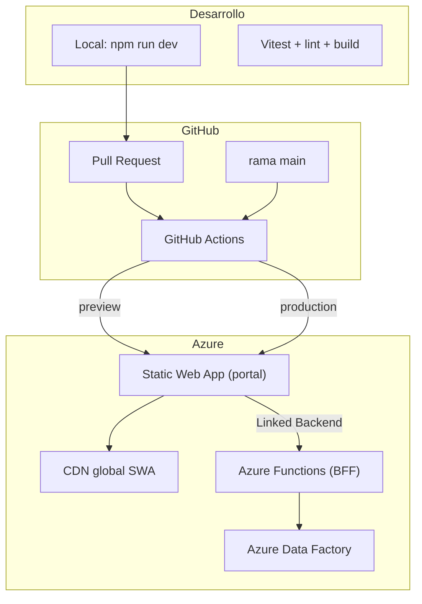
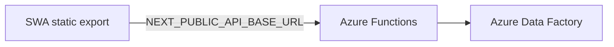

# Plan de despliegue — Azure Static Web Apps

Guía para publicar **Automatización de Licencias** en Azure Static Web Apps (SWA), alineada con el stack actual (Next.js 15, mocks en cliente, sin API routes).

---

## 1. Resumen ejecutivo

| Modelo | Cuándo usarlo | Para este proyecto |
|--------|---------------|-------------------|
| **Static** (`output: "export"`) | Portal sin backend embebido | **Recomendado — implementado** |
| **Hybrid** (`output: "standalone"`) | SSR + `/api/*` en Next.js | **No necesario** — la API vive en Azure Functions |

El portal encaja en **modo Static** porque:

- La API (BFF) está en **Azure Functions**, no en Next.js
- ADF se invoca desde Functions, no desde el navegador
- El CSV se parsea en cliente y se envía como JSON (`lib/csv-parser.ts`)

**No se requiere migrar a hybrid Next.js** cuando se conecte el backend real.

---

## 2. Arquitectura objetivo



---

## 3. Prerrequisitos

| Recurso | Acción |
|---------|--------|
| **Repositorio GitHub** | Subir el proyecto |
| **Suscripción Azure** | Con permisos para crear SWA |
| **Cuenta de despliegue** | GitHub Actions con secretos de SWA |
| **Node.js 20** | En CI y en configuración de SWA |

---

## 4. Cambios de código (Fase 1 — Static)

### 4.1 `next.config.ts`

```typescript
import type { NextConfig } from "next";

const nextConfig: NextConfig = {
  reactStrictMode: true,
  output: "export",
  images: { unoptimized: true }, // requerido para static export (usa next/image en sidebar)
};

export default nextConfig;
```

### 4.2 Redirección `/` → `/login`

`redirect()` de servidor **no funciona** con static export. Opciones:

- **Opción A (recomendada):** regla en `staticwebapp.config.json`
- **Opción B:** componente cliente en `app/page.tsx` con `useRouter().replace("/login")`

### 4.3 `staticwebapp.config.json` (raíz del proyecto)

```json
{
  "navigationFallback": {
    "rewrite": "/login/index.html",
    "exclude": ["/_next/*", "/*.{css,js,png,jpg,jpeg,gif,svg,ico,woff,woff2}"]
  },
  "routes": [
    { "route": "/", "redirect": "/login", "statusCode": 302 }
  ]
}
```

Ajustar `exclude` según los assets en `public/`.

### 4.4 Scripts en `package.json`

```json
{
  "scripts": {
    "test": "vitest",
    "test:run": "vitest run",
    "build:static": "next build"
  }
}
```

Con `output: "export"`, `next build` genera la carpeta `out/`.

### 4.5 Verificación local antes de Azure

```bash
npm run build
npx serve out
```

Comprobar manualmente:

- `/login`
- `/dashboard`
- `/aprovisionar`
- `/reportes`
- `/configuracion`
- Assets en `public/` (p. ej. `tecMilenioFondo.jpeg`)

---

## 5. CI/CD — GitHub Actions

### 5.1 Pipeline de calidad (`.github/workflows/ci.yml`)

En cada PR y push a `main`:

1. `npm ci`
2. `npm run lint`
3. `npm run test:run` (cuando existan tests)
4. `npm run build` (valida que el export estático compila)

Ejemplo:

```yaml
name: CI

on:
  push:
    branches: [main]
  pull_request:
    branches: [main]

jobs:
  quality:
    runs-on: ubuntu-latest

    steps:
      - uses: actions/checkout@v4

      - uses: actions/setup-node@v4
        with:
          node-version: "20"
          cache: "npm"

      - run: npm ci

      - run: npm run lint

      - run: npm run test:run

      - run: npm run build
```

### 5.2 Pipeline de deploy (generado por Azure)

Al crear la SWA desde el portal, Azure genera `.github/workflows/azure-static-web-apps-*.yml`. Parámetros clave para **modo Static**:

| Parámetro | Valor |
|-----------|-------|
| `app_location` | `/` |
| `api_location` | `""` (Functions es linked backend, no carpeta local) |
| `output_location` | `out` |
| `app_build_command` | `npm run build` |

Vincular **Azure Functions** como Linked Backend en la SWA desde el portal de Azure.

En la tarea de deploy, para static export:

```yaml
env:
  IS_STATIC_EXPORT: true
```

### 5.3 Flujo de ramas

| Rama / evento | Resultado |
|---------------|-----------|
| PR → `main` | Preview URL (`*.azurestaticapps.net`) |
| Merge a `main` | Producción |
| Push a otras ramas | Opcional: previews si se configuran |

---

## 6. Creación del recurso en Azure

### Paso a paso (portal)

1. **Azure Portal** → Create → **Static Web App**
2. **Subscription / Resource group** (ej. `rg-licencias-prod`)
3. **Name:** `swa-licencias-tecmilenio` (debe ser único globalmente)
4. **Plan:** Free (dev/demo) o Standard (dominio custom, más slots, auth avanzada)
5. **Deployment source:** GitHub → seleccionar repo + rama `main`
6. **Build Presets:** Next.js
7. Ajustar:
   - App location: `/`
   - Output location: `out`
   - API location: vacío

Azure crea automáticamente el workflow y el secret `AZURE_STATIC_WEB_APPS_API_TOKEN` en GitHub.

### Entornos sugeridos

| Entorno | Recurso SWA | Rama |
|---------|-------------|------|
| **Preview** | Mismo SWA (staging automático por PR) | PRs |
| **Producción** | Mismo SWA | `main` |
| **Producción aislada** (opcional) | Segunda SWA | `main` con approval manual |

---

## 7. Pruebas unitarias (integradas al plan)

Prioridad alineada con Clean Architecture:

| Fase | Qué probar | Herramienta |
|------|------------|-------------|
| 1 | 5 casos de uso en `application/use-cases/` | Vitest + mocks de ports |
| 2 | Hooks principales (`use-aprovisionar`, etc.) | Vitest + Testing Library |
| 3 | Smoke E2E opcional (`/login` → `/dashboard`) | Playwright en CI (opcional) |

El CI **bloquea deploy** si fallan lint, tests o build.

### Instalación de Vitest

```bash
npm install -D vitest @vitejs/plugin-react jsdom @testing-library/react @testing-library/jest-dom
```

### Ejemplo de test (caso de uso)

```typescript
// application/use-cases/__tests__/aprovisionar-licencias.use-case.test.ts
import { describe, it, expect, vi } from "vitest";
import { AprovisionarLicenciasUseCase } from "../aprovisionar-licencias.use-case";
import type { ILicenciaRepository } from "@/domain/ports/licencia-repository.port";

describe("AprovisionarLicenciasUseCase", () => {
  it("lanza error si no hay archivo", async () => {
    const repo = { procesar: vi.fn() } as unknown as ILicenciaRepository;
    const useCase = new AprovisionarLicenciasUseCase(repo);

    await expect(
      useCase.ejecutar({
        software: "adobe",
        tipo: "aprov",
        archivoNombre: "",
      })
    ).rejects.toThrow("Debe seleccionar un archivo CSV");
  });
});
```

---

## 8. Variables de entorno

Hoy no hay `.env` críticos (mocks). Preparar para integraciones futuras:

| Variable | Cuándo | Dónde configurar |
|----------|--------|------------------|
| `NEXT_PUBLIC_API_BASE_URL` | Azure Functions (BFF) | SWA → Configuration → Application settings |
| Token NAM | Auth producción | Pendiente doc identidad ITESM |
| Secrets Adobe/Minitab | Nunca en front | Key Vault → Functions (validar Juan Manuel) |

> En static export, solo variables `NEXT_PUBLIC_*` están disponibles en el cliente (se inlined en build).

---

## 9. Autenticación (fase futura — NAM)

Hoy el login es demo (`router.push("/dashboard")`). Para producción:

1. Registrar la app con **identidad ITESM**: `dsi.identidad@itesm.mx`
2. Integrar **NAM** según documentación del equipo identidad
3. Roles (`admin`, `ejecutor`, `auditor`) desde claims del token
4. Functions valida token en cada request

Ver [DECISIONES-ARQUITECTURA.md](./DECISIONES-ARQUITECTURA.md).

---

## 10. Backend con Azure Functions (sin hybrid Next.js)

Cuando Alfonso despliegue Azure Functions:



Pasos:

1. Desplegar Azure Functions con endpoints `/v1/*`
2. Vincular Functions como **Linked Backend** en la SWA
3. Configurar `NEXT_PUBLIC_API_BASE_URL` en SWA
4. En el portal, cambiar DI a `HttpLicenciaRepository` (y demás repos HTTP)

**No es necesario** quitar `output: "export"` ni migrar a hybrid Next.js.

---

## 11. Plan por fases

### Fase 0 — Preparación (0.5 día)

- [ ] Inicializar git y subir a GitHub
- [ ] Definir rama `main` + protección con status checks

### Fase 1 — Static deploy (1 día)

- [ ] Ajustar `next.config.ts` (`export` + `images.unoptimized`)
- [ ] Crear `staticwebapp.config.json`
- [ ] Resolver redirect de `/`
- [ ] Validar `npm run build` + `serve out` local
- [ ] Crear SWA en Azure y conectar GitHub
- [ ] Primer deploy exitoso a URL `*.azurestaticapps.net`

### Fase 2 — CI de calidad (0.5–1 día)

- [ ] Vitest + tests de casos de uso
- [ ] Workflow `ci.yml` (lint + test + build)
- [ ] Branch protection en `main`

### Fase 3 — Producción institucional (1–2 días)

- [ ] Dominio custom (ej. `licencias.tecmilenio.mx`)
- [ ] Certificado SSL (automático en SWA)
- [ ] Plan Standard si se requiere SLA / más entornos
- [ ] Integración **NAM** para login real

### Fase 4 — Backend (cuando aplique)

- [ ] Azure Functions desplegadas y vinculadas como Linked Backend
- [ ] Sustituir mocks por repos HTTP (`HttpLicenciaRepository`, etc.)
- [ ] Key Vault para credenciales Adobe/Minitab

---

## 12. Riesgos y mitigaciones

| Riesgo | Mitigación |
|--------|------------|
| `redirect()` rompe static export | Regla en `staticwebapp.config.json` o redirect en cliente |
| `next/image` sin optimización server | `images.unoptimized: true` |
| Rutas SPA 404 al refrescar | `navigationFallback` en `staticwebapp.config.json` |
| Deploy híbrido con timeout (Next 15.3+) | Mantener modo Static hasta necesitar SSR/API |
| Secrets en frontend | Solo `NEXT_PUBLIC_*`; secrets en Functions/backend |
| Tamaño del bundle | Monitorear en CI; límite híbrido ~250 MB |

---

## 13. Checklist de listo para producción

- [ ] Build estático pasa en CI
- [ ] Las 5 rutas principales cargan en preview SWA
- [ ] Assets (`tecMilenioFondo.jpeg`, logos) se sirven correctamente
- [ ] PR previews funcionan
- [ ] Merge a `main` despliega automáticamente
- [ ] (Opcional) Dominio custom configurado
- [ ] (Opcional) Auth institucional activa

---

## 14. Referencias

- [Next.js support on Azure Static Web Apps](https://learn.microsoft.com/en-us/azure/static-web-apps/nextjs)
- [Deploy hybrid Next.js on SWA](https://learn.microsoft.com/en-us/azure/static-web-apps/deploy-nextjs-hybrid)
- [Configuration file for SWA](https://learn.microsoft.com/en-us/azure/static-web-apps/configuration)
- [Arquitectura del proyecto](./ARQUITECTURA.md)
- [Decisiones de arquitectura Azure](./DECISIONES-ARQUITECTURA.md)
- [Endpoints Épica 2](./EPICA-2-ENDPOINTS.md)

---

## 15. Orden de implementación recomendado

1. Cambios de código para static export
2. Workflow `ci.yml`
3. Repo en GitHub
4. Crear SWA en Azure (genera el workflow de deploy)
5. Vitest + tests de casos de uso
