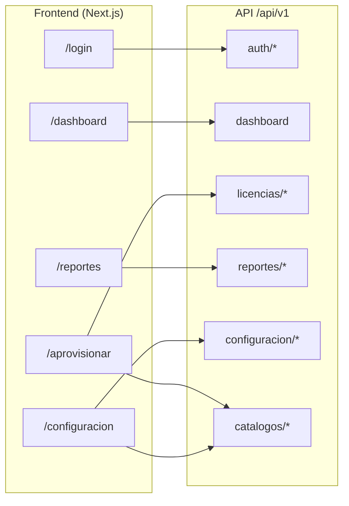

# Épica 2 — Endpoints front ↔ back

Definición de endpoints necesarios entre el frontend (Next.js) y el backend, alineada con los casos de uso, hooks y módulos actuales del proyecto.

**Convención:** prefijo `/api/v1`, JSON (salvo upload/export), autenticación con Bearer JWT o cookie de sesión (Azure Entra ID en producción).

---

## Mapa general



---

## 1. Autenticación y sesión

| Método | Endpoint | Rol | Descripción |
|--------|----------|-----|-------------|
| `POST` | `/api/v1/auth/login` | Público | Login (o redirect SSO Entra ID) |
| `GET` | `/api/v1/auth/me` | Autenticado | Usuario + rol (`admin` \| `ejecutor` \| `auditor`) |
| `POST` | `/api/v1/auth/logout` | Autenticado | Cerrar sesión |
| `POST` | `/api/v1/auth/refresh` | Autenticado | Renovar token (si se usa JWT) |

**Response `GET /auth/me` (ejemplo):**

```json
{
  "id": "usr-001",
  "email": "ejecutor@tecmilenio.mx",
  "nombre": "María López",
  "rol": "ejecutor"
}
```

---

## 2. Dashboard

**Caso de uso:** `ObtenerDashboardUseCase` · **Hook:** `useDashboard`

| Método | Endpoint | Roles |
|--------|----------|-------|
| `GET` | `/api/v1/dashboard` | admin, auditor |

**Query params (opcionales):**

| Param | Descripción |
|-------|-------------|
| `periodo` | Filtrar métricas por período académico |

**Response 200:**

```json
{
  "periodo": "2026-Agosto",
  "stats": [
    {
      "label": "Licencias activas",
      "value": "1,240",
      "sub": "Adobe + Minitab",
      "trend": "+12%",
      "positive": true
    }
  ],
  "tendencia": [
    { "mes": "Ene", "adobe": 312, "minitab": 88 }
  ],
  "actividadReciente": [
    {
      "fecha": "14 Feb 2024",
      "software": "Adobe",
      "tipo": "APROV",
      "estado": "Completado"
    }
  ]
}
```

---

## 3. Aprovisionamiento de licencias

**Caso de uso:** `AprovisionarLicenciasUseCase` · **Hook:** `useAprovisionar`

> El front hoy solo envía `archivoNombre`. El backend debe recibir el CSV real vía `multipart/form-data`.

| Método | Endpoint | Roles | Descripción |
|--------|----------|-------|-------------|
| `POST` | `/api/v1/licencias/operaciones` | admin, ejecutor | Inicia alta/baja masiva |
| `GET` | `/api/v1/licencias/operaciones/{operacionId}` | admin, ejecutor | Estado de operación (async) |
| `GET` | `/api/v1/licencias/operaciones` | admin, ejecutor | Historial reciente (opcional) |

### `POST /api/v1/licencias/operaciones`

**Content-Type:** `multipart/form-data`

| Campo | Tipo | Requerido |
|-------|------|-----------|
| `software` | `adobe` \| `minitab` | Sí |
| `periodo` | string | Sí |
| `tipo` | `aprov` \| `desaprov` | Sí |
| `archivo` | file (CSV) | Sí |

**Response 202 (async):**

```json
{
  "operacionId": "OP-ABC123",
  "registrosProcesados": 0,
  "estado": "En Proceso",
  "mensaje": "Operación en cola. Consulta el estado con operacionId."
}
```

**Response 200 (sync):**

```json
{
  "operacionId": "OP-ABC123",
  "registrosProcesados": 150,
  "estado": "Completado",
  "mensaje": "150 registros procesados correctamente"
}
```

### `GET /api/v1/licencias/operaciones/{operacionId}`

```json
{
  "operacionId": "OP-ABC123",
  "software": "adobe",
  "tipo": "aprov",
  "registrosProcesados": 148,
  "registrosFallidos": 2,
  "estado": "Completado",
  "mensaje": "148 OK, 2 pendientes de revisión",
  "detalleErroresUrl": "/api/v1/licencias/operaciones/OP-ABC123/errores.csv"
}
```

---

## 4. Reportes e historial

**Caso de uso:** `ObtenerReportesUseCase` · **Hook:** `useReportes`

| Método | Endpoint | Roles | Descripción |
|--------|----------|-------|-------------|
| `GET` | `/api/v1/reportes` | admin, auditor | Listado paginado + filtros + estadísticas |
| `GET` | `/api/v1/reportes/estadisticas` | admin, auditor | KPIs del panel (opcional, separado del listado) |
| `GET` | `/api/v1/reportes/export` | admin, auditor | Export Excel/CSV |
| `GET` | `/api/v1/reportes/{movimientoId}` | admin, auditor | Detalle de un movimiento |

### `GET /api/v1/reportes`

**Query params:**

| Param | Ejemplo |
|-------|---------|
| `software` | `adobe`, `minitab`, `todos` |
| `accion` | `alta`, `baja`, `todas` |
| `origen` | `etl`, `manual`, `todos` |
| `busqueda` | texto libre (nombre, id, clave) |
| `page` | `1` |
| `pageSize` | `5` (default) |

**Response 200:**

```json
{
  "items": [
    {
      "fecha": "17/06/2026",
      "hora": "09:15",
      "nombre": "Ana García",
      "id": "T00123456",
      "clave": "BAN-8821",
      "nivel": "Profesional",
      "software": "Adobe",
      "accion": "Alta",
      "origen": "Manual",
      "operador": "ejecutor@tecmilenio.mx"
    }
  ],
  "total": 42,
  "page": 1,
  "pageSize": 5,
  "totalPages": 9,
  "estadisticas": {
    "totalMovimientos": "1,284",
    "altasTotales": "895",
    "bajasTotales": "389",
    "movimientosManuales": "156"
  }
}
```

### `GET /api/v1/reportes/export`

Mismos filtros que el listado.

**Response:** `Content-Type: text/csv` o `application/vnd.openxmlformats-officedocument.spreadsheetml.sheet`

---

## 5. Configuración del sistema

**Casos de uso:** `ObtenerConfiguracionUseCase`, `ActualizarPeriodicidadUseCase` · **Hook:** `useConfiguracion`

| Método | Endpoint | Roles | Descripción |
|--------|----------|-------|-------------|
| `GET` | `/api/v1/configuracion` | admin, ejecutor | Proveedores + programador |
| `PATCH` | `/api/v1/configuracion/programador` | admin, ejecutor | Actualizar periodicidad ETL |
| `PATCH` | `/api/v1/configuracion/proveedores/{softwareId}/mapping` | admin, ejecutor | Editar mapeo Banner ↔ API |
| `POST` | `/api/v1/configuracion/proveedores` | admin | Registrar nuevo proveedor |

### `GET /api/v1/configuracion`

```json
{
  "proveedores": [
    {
      "id": "adobe",
      "nombre": "Adobe Creative Cloud",
      "icon": "Ad",
      "mapping": [
        { "local": "banner_id", "api": "federatedID" }
      ]
    }
  ],
  "programador": {
    "periodicidad": "Diario (Nocturno)",
    "proximaEjecucion": "25/06/2026 02:00"
  }
}
```

### `PATCH /api/v1/configuracion/programador`

**Request:**

```json
{ "periodicidad": "Semanal" }
```

**Response:** objeto `ProgramadorTareas` actualizado.

### `PATCH /api/v1/configuracion/proveedores/{softwareId}/mapping`

**Request:**

```json
{
  "mapping": [
    { "local": "banner_id", "api": "federatedID" }
  ]
}
```

---

## 6. Catálogos

Valores hoy hardcodeados en la UI; conviene servirlos desde el backend.

| Método | Endpoint | Roles | Uso |
|--------|----------|-------|-----|
| `GET` | `/api/v1/catalogos/software` | Autenticado | Select en aprovisionar |
| `GET` | `/api/v1/catalogos/periodos` | Autenticado | Select de período académico |
| `GET` | `/api/v1/catalogos/filtros-reportes` | admin, auditor | Valores dinámicos de filtros |

**Ejemplo `GET /catalogos/periodos`:**

```json
[
  { "id": "ene-may-2025", "label": "Ene-May 2025" },
  { "id": "sep-dic-2025", "label": "Sep-Dic 2025" }
]
```

---

## 7. Jobs y operaciones del sistema (Fase 4)

Sincronización automática con Banner (mencionada en UI, sin caso de uso aún).

| Método | Endpoint | Roles | Descripción |
|--------|----------|-------|-------------|
| `POST` | `/api/v1/jobs/sincronizacion-banner` | admin, sistema | Disparo manual del ETL |
| `GET` | `/api/v1/jobs/sincronizacion-banner/ultima` | admin, ejecutor | Última ejecución y resultado |
| `GET` | `/api/v1/health` | Público / interno | Health check para Azure |

---

## 8. Resumen por prioridad

### MVP (Épica 2 — reemplazar mocks)

| # | Método | Endpoint | Caso de uso |
|---|--------|----------|-------------|
| 1 | `GET` | `/api/v1/dashboard` | ObtenerDashboard |
| 2 | `POST` | `/api/v1/licencias/operaciones` | AprovisionarLicencias |
| 3 | `GET` | `/api/v1/reportes` | ObtenerReportes |
| 4 | `GET` | `/api/v1/configuracion` | ObtenerConfiguracion |
| 5 | `PATCH` | `/api/v1/configuracion/programador` | ActualizarPeriodicidad |
| 6 | `GET` | `/api/v1/auth/me` | Sesión y rol |

### Fase 2.1 (UI ya lo anticipa)

| # | Método | Endpoint |
|---|--------|----------|
| 7 | `GET` | `/api/v1/reportes/export` |
| 8 | `GET` | `/api/v1/licencias/operaciones/{operacionId}` |
| 9 | `GET` | `/api/v1/catalogos/periodos` |
| 10 | `PATCH` | `/api/v1/configuracion/proveedores/{softwareId}/mapping` |

### Fase 3–4 (producción institucional)

| # | Método | Endpoint |
|---|--------|----------|
| 11 | `POST` | `/api/v1/auth/login` (+ SSO Entra ID) |
| 12 | `POST` | `/api/v1/jobs/sincronizacion-banner` |
| 13 | `GET` | `/api/v1/health` |

---

## 9. Matriz de autorización

| Endpoint | admin | ejecutor | auditor |
|----------|:-----:|:--------:|:-------:|
| `GET /dashboard` | ✓ | — | ✓ |
| `POST /licencias/operaciones` | ✓ | ✓ | — |
| `GET /licencias/operaciones/*` | ✓ | ✓ | — |
| `GET /reportes*` | ✓ | — | ✓ |
| `GET /configuracion` | ✓ | ✓ | — |
| `PATCH /configuracion/*` | ✓ | ✓ | — |
| `POST /configuracion/proveedores` | ✓ | — | — |
| `POST /jobs/*` | ✓ | — | — |
| `GET /catalogos/*` | ✓ | ✓ | ✓ |

---

## 10. Cambio requerido en el frontend

Hoy `useAprovisionar` solo envía el nombre del archivo:

```typescript
// hooks/use-aprovisionar.ts
await container.aprovisionarLicencias.ejecutar({
  software,
  periodo,
  tipo: tipoOp,
  archivoNombre: fileName, // ← falta el File real
});
```

Al conectar el backend:

1. Guardar el objeto `File` (no solo `fileName`)
2. Enviar `FormData` a `POST /api/v1/licencias/operaciones`
3. Hacer polling a `GET /licencias/operaciones/{id}` si la respuesta es `202`

---

## 11. Mapeo endpoint ↔ capa del proyecto

| Endpoint | Caso de uso | Hook | Puerto de dominio |
|----------|-------------|------|-------------------|
| `GET /dashboard` | `ObtenerDashboardUseCase` | `useDashboard` | `IDashboardRepository` |
| `POST /licencias/operaciones` | `AprovisionarLicenciasUseCase` | `useAprovisionar` | `ILicenciaRepository` |
| `GET /reportes` | `ObtenerReportesUseCase` | `useReportes` | `IReporteRepository` |
| `GET /configuracion` | `ObtenerConfiguracionUseCase` | `useConfiguracion` | `IConfiguracionRepository` |
| `PATCH /configuracion/programador` | `ActualizarPeriodicidadUseCase` | `useConfiguracion` | `IConfiguracionRepository` |

Al implementar el backend, crear repositorios HTTP en `infrastructure/repositories/` que implementen los mismos puertos sin modificar dominio ni casos de uso.

---

## Referencias

- [Arquitectura del proyecto](./ARQUITECTURA.md)
- [Plan de despliegue Azure SWA](./DEPLOY-AZURE-SWA.md)
