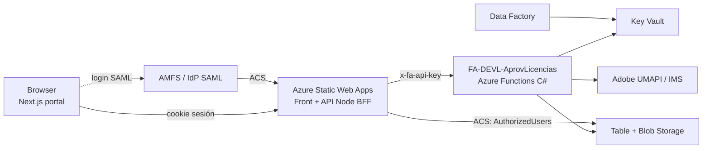
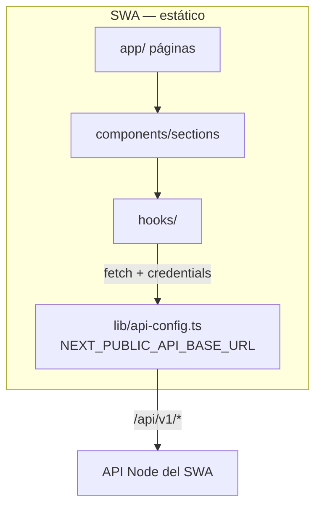
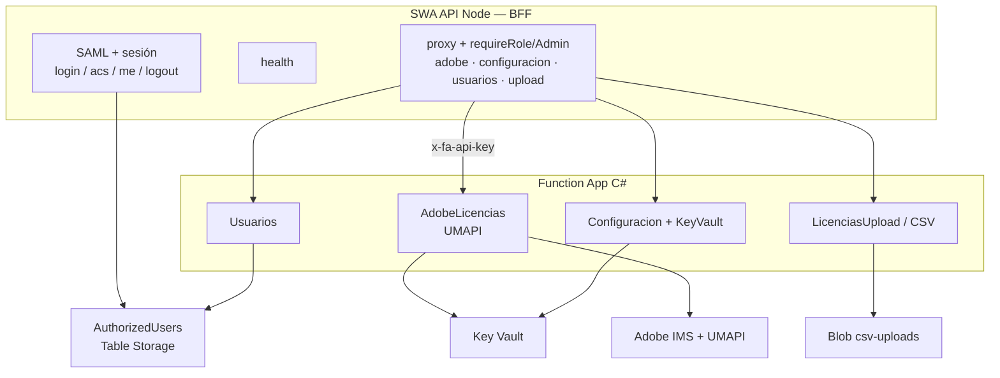
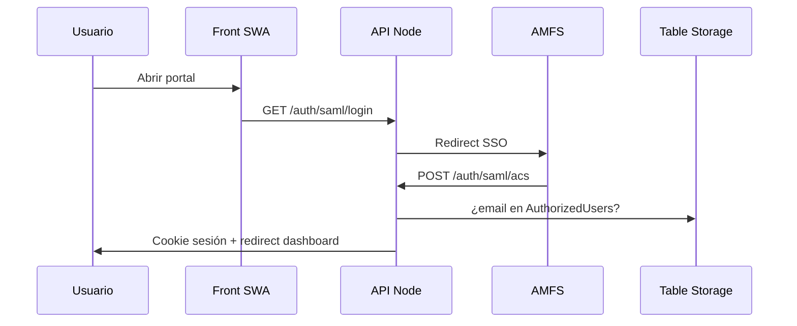
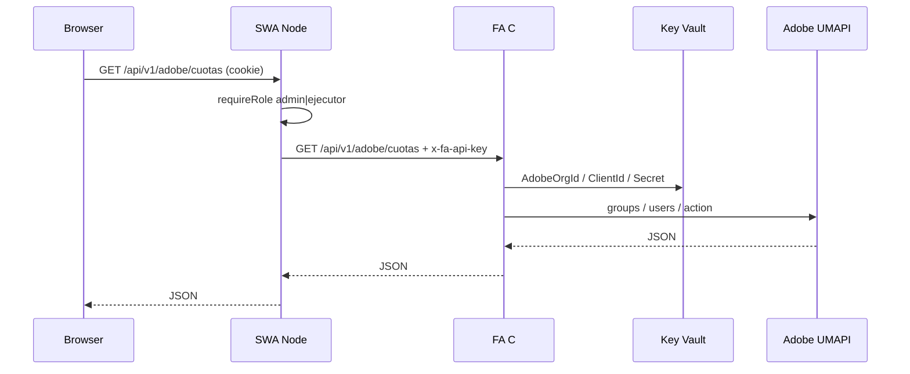
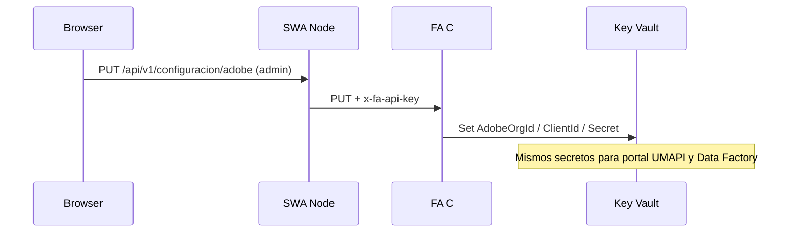
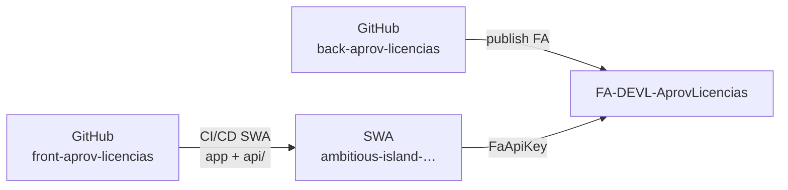

# Arquitectura Front–Back

Diagrama del portal (**front-aprov-licencias**) y el backend (**back-aprov-licencias** / FA C#) en el modelo actual (**version4**): BFF Node en el SWA + lógica de negocio en Function App C#.

---

## 1. Vista general

| Pieza | Repo / recurso | Rol |
|-------|----------------|-----|
| **Front** | `front-aprov-licencias` (Next.js → `out/`) | UI portal |
| **BFF Node** | `front-aprov-licencias/api/` en el mismo SWA | SAML, sesión, proxy |
| **Back C#** | `back-aprov-licencias/function-app-csharp` → `fa-devl-aprovlicencias` | Adobe, KV, usuarios, CSV |
| **Secretos Adobe** | `KV-DEVL-AprovLicencias` | Portal UMAPI + ADF |

---

## 2. Front (portal)

Rutas típicas del portal:

| UI | API (vía SWA) |
|----|----------------|
| Login | `/api/v1/auth/saml/login` → ACS |
| Cuotas Adobe | `GET /api/v1/adobe/cuotas` |
| Detalle alumnos / profesores | `GET /api/v1/adobe/miembros?perfil=` |
| Asignación licencias | `GET/POST /api/v1/adobe/*` |
| Usuarios | `/api/v1/usuarios` |
| Configuración Adobe | `GET/PUT /api/v1/configuracion/*` |
| Carga CSV | `POST /api/v1/licencias/upload` |

El browser **nunca** llama a la FA ni lleva `FaApiKey`.

---

## 3. Back (BFF Node + FA C#)

### Qué hace cada capa

| Capa | Activo | Responsabilidad |
|------|--------|-----------------|
| **Node (SWA)** | Sí — auth + proxy | Cookie SAML, roles, reenvío a FA |
| **C# (FA)** | Sí — negocio | Key Vault, UMAPI, CRUD usuarios, blob |
| **Node libs muertas** | Eliminadas | `adobe-umapi`, `key-vault`, `blob-storage` ya no existen |

### Auth

| Canal | Mecanismo |
|-------|-----------|
| Browser ↔ SWA | Cookie de sesión (HMAC, HttpOnly) + rol `admin` / `ejecutor` |
| SWA ↔ FA | Header `x-fa-api-key` (`FaApiKey`) |
| FA ↔ Key Vault | Managed Identity |
| FA ↔ Adobe | Client credentials (secretos en KV) |

---

## 4. Flujos principales

### 4.1 Login SAML

### 4.2 Cuotas / miembros / licencias Adobe

### 4.3 Configuración Adobe → Key Vault

---

## 5. Despliegue (DEVL)

| Setting SWA (API) | Uso |
|-------------------|-----|
| `FaApiKey` | Auth hacia FA |
| `FaBaseUrl` | Default `https://fa-devl-aprovlicencias.azurewebsites.net` |
| SAML + `SESSION_SECRET` | Login |
| `StorageConnectionString` | ACS → AuthorizedUsers |

| Setting FA | Uso |
|------------|-----|
| `FaApiKey` | Valida llamadas del SWA |
| `KeyVaultUrl` | Secretos Adobe |
| `StorageConnectionString` | Usuarios + upload CSV |

Health del portal: `GET /api/v1/health` → `"mode":"bff-proxy-to-fa-csharp"`, `"faProxy":true`.

---

## 6. Repos

| Repo | Contenido |
|------|-----------|
| [front-aprov-licencias](https://github.com/ti-tecmilenio-oficial/front-aprov-licencias) | Next.js + API Node BFF |
| `back-aprov-licencias` | Function App C# (`function-app-csharp`) |

Detalle del proxy: [SWA-FA-PROXY.md](./SWA-FA-PROXY.md) · Key Vault: [CONFIG-KEYVAULT.md](./CONFIG-KEYVAULT.md)
