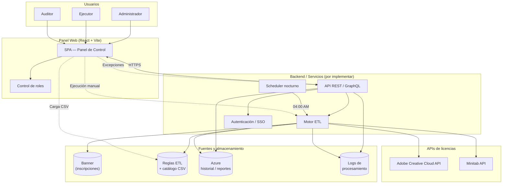
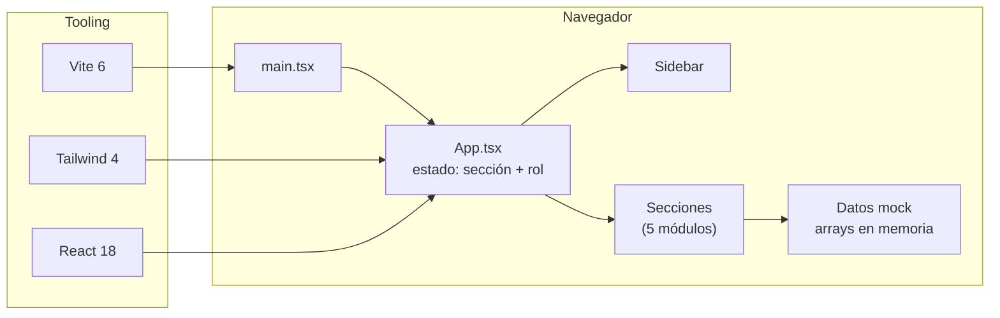
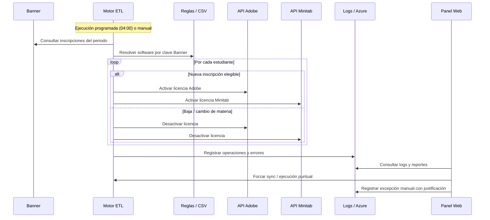

# Panel de Control de Licenciamiento Académico

Plataforma web para administrar licencias de software académico (Adobe Creative Cloud, Minitab Statistical) en un entorno universitario. Permite automatizar altas y bajas de licencias según inscripciones en Banner, ejecutar procesos manualmente, gestionar excepciones y auditar el historial de movimientos.

> **Estado actual:** prototipo funcional de interfaz generado desde [Figma Make](https://www.figma.com/design/hyNNhRCDhT84KCeYTPFh5Z/Idea-1-Panel-Control-Licenciamirnto). Los datos son simulados en el frontend; no hay backend ni integraciones reales con APIs externas todavía.

---

## Problema que resuelve

Las universidades contratan paquetes de licencias de software (p. ej. 500 Adobe CC, 150 Minitab) y deben asignarlas a estudiantes inscritos en materias específicas. Hoy ese proceso suele ser manual, propenso a errores y difícil de auditar.

Este panel centraliza:

- **Visibilidad** del uso de licencias y estado de las APIs proveedoras.
- **Reglas ETL** que mapean periodo académico + nivel + clave Banner → software.
- **Ejecución** automática (nocturna) o manual del aprovisionamiento.
- **Excepciones** con justificación obligatoria y trazabilidad.
- **Reportes** de altas, bajas y movimientos manuales para auditores.

---

## Stack tecnológico

| Capa | Tecnología |
|------|------------|
| Framework UI | React 18 |
| Build | Vite 6 |
| Estilos | Tailwind CSS 4 + variables CSS (`theme.css`) |
| Gráficas | Recharts |
| Iconos | Lucide React |
| Componentes base | Radix UI + shadcn/ui (`src/app/components/ui/`) |
| Tipografía | Inter (UI) + JetBrains Mono (métricas) |

---

## Estructura del proyecto

```
src/
├── main.tsx                    # Punto de entrada
├── app/
│   ├── App.tsx                 # Layout principal, navegación y control de roles
│   └── components/
│       ├── Sidebar.tsx         # Navegación lateral, selector de rol y periodo
│       ├── OverviewSection.tsx # Panel general y métricas
│       ├── EtlSection.tsx      # Reglas ETL y carga CSV
│       ├── EjecucionSection.tsx# Disparo manual del servicio
│       ├── LogsSection.tsx     # Logs, resultados CSV y anulación manual
│       ├── ReportesSection.tsx # Historial y exportación
│       ├── figma/              # Utilidades de assets Figma
│       └── ui/                 # Biblioteca de componentes reutilizables
└── styles/
    ├── index.css
    ├── theme.css               # Tokens de diseño (colores, sidebar, estados)
    ├── fonts.css
    └── tailwind.css
```

---

## Módulos funcionales

### 1. Panel General (`overview`)

Dashboard en tiempo real con:

- Tarjetas de métricas: licencias totales, Adobe activas, Minitab activas, estudiantes cubiertos.
- Gráfica de tendencia mensual (Recharts).
- Badges de estado de API (Adobe / Minitab).
- Alertas críticas cuando el uso supera el 90 % del cupo contratado.

### 2. Configuración ETL (`etl`)

Motor de reglas de activación automática:

```
Periodo académico + Nivel de estudios + Clave Banner → Software asignado
```

Incluye:

- **Constructor de reglas** con vista previa antes de guardar.
- **Tabla de reglas** con filtros, edición, activación/desactivación y conteo de estudiantes.
- **Carga masiva CSV** (drag & drop) para catálogos de materias/estudiantes.

### 3. Ejecución de Servicio (`ejecucion`)

Permite al rol **Ejecutor** disparar el aprovisionamiento de forma puntual:

- Selección de curso (clave Banner), periodo y servicio (Adobe / Minitab).
- Simulación de ejecución con estados: `idle → running → done | error`.
- Historial de ejecuciones recientes con mensajes de resultado.

### 4. Logs y Procesamiento (`logs`)

Centro operativo para monitoreo y excepciones:

- **Resultados del último CSV** procesado (filas OK, advertencia, error).
- **Registro de actividad** filtrable (sincronización, activación, desactivación, error, advertencia).
- **Anulación manual**: búsqueda de estudiante, asignación/revocación con justificación obligatoria.
- **Forzar sincronización** inmediata del ETL.

### 5. Reportes e Historial (`reports`)

Vista orientada al **Auditor**:

- Tabla paginada de asignaciones (alta/baja, origen ETL o manual, operador, justificación).
- Filtros por software, acción y origen; búsqueda por ID, nombre o clave.
- Estadísticas resumidas del periodo.
- Exportación simulada a Excel/CSV (referencia a almacenamiento en Azure).

---

## Control de acceso por roles

El selector de rol en el sidebar simula RBAC. Cada rol ve solo las secciones permitidas:

| Sección | Administrador | Ejecutor | Auditor |
|---------|:-------------:|:--------:|:-------:|
| Panel General | ✓ | ✓ | ✓ |
| Configuración ETL | ✓ | ✓ | — |
| Ejecución de Servicio | ✓ | ✓ | — |
| Logs y Procesamiento | ✓ | ✓ | — |
| Reportes e Historial | ✓ | — | ✓ |

La lógica de restricción vive en `App.tsx`: si el usuario intenta acceder a una sección no permitida, se muestra un mensaje de acceso restringido y se redirige al cambiar de rol.

---

## Diagrama de arquitectura

### Arquitectura objetivo (sistema completo)

Representa el ecosistema que este prototipo está diseñado para orquestar:



### Arquitectura actual (implementación en repo)

Estado real del código hoy — frontend autocontenido con datos mock:



### Flujo ETL (lógica de negocio)



---

## Flujo de datos principal

1. **Configuración:** un administrador define reglas ETL o sube un CSV con el catálogo de materias.
2. **Sincronización:** el ETL (nocturno o forzado) lee inscripciones en Banner y aplica las reglas.
3. **Aprovisionamiento:** se llaman las APIs de Adobe/Minitab para altas y bajas.
4. **Registro:** cada operación queda en logs; los movimientos se persisten para reportes (Azure).
5. **Excepciones:** operadores asignan o revocan licencias manualmente con justificación auditada.
6. **Supervisión:** el panel muestra métricas, alertas de capacidad y estado de APIs.

---

## Cómo ejecutar el proyecto

```bash
npm install
npm run dev
```

Compilación para producción:

```bash
npm run build
```

---

## Próximos pasos sugeridos

Para evolucionar de prototipo a producto:

1. **Backend API** con autenticación institucional (SSO/LDAP).
2. **Integración Banner** para lectura de inscripciones en tiempo real o por lotes.
3. **Conectores Adobe y Minitab** con manejo de rate limits y reintentos.
4. **Persistencia** en base de datos + Azure Blob/Tables para reportes históricos.
5. **Scheduler** (Azure Functions, cron, etc.) para el ETL nocturno.
6. **Reemplazar datos mock** por llamadas API en cada sección del frontend.

---

## Referencias

- Diseño original: [Figma — Idea 1 Panel Control Licenciamiento](https://www.figma.com/design/hyNNhRCDhT84KCeYTPFh5Z/Idea-1-Panel-Control-Licenciamirnto)
- Punto de entrada de la app: `src/main.tsx` → `src/app/App.tsx`
